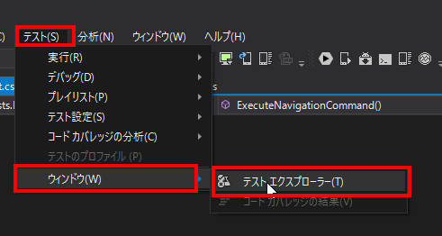
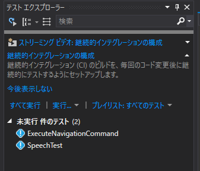
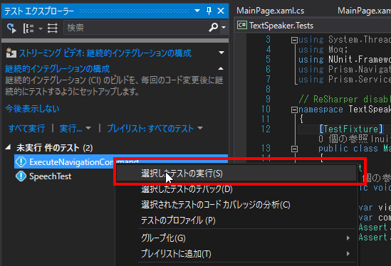
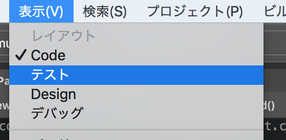
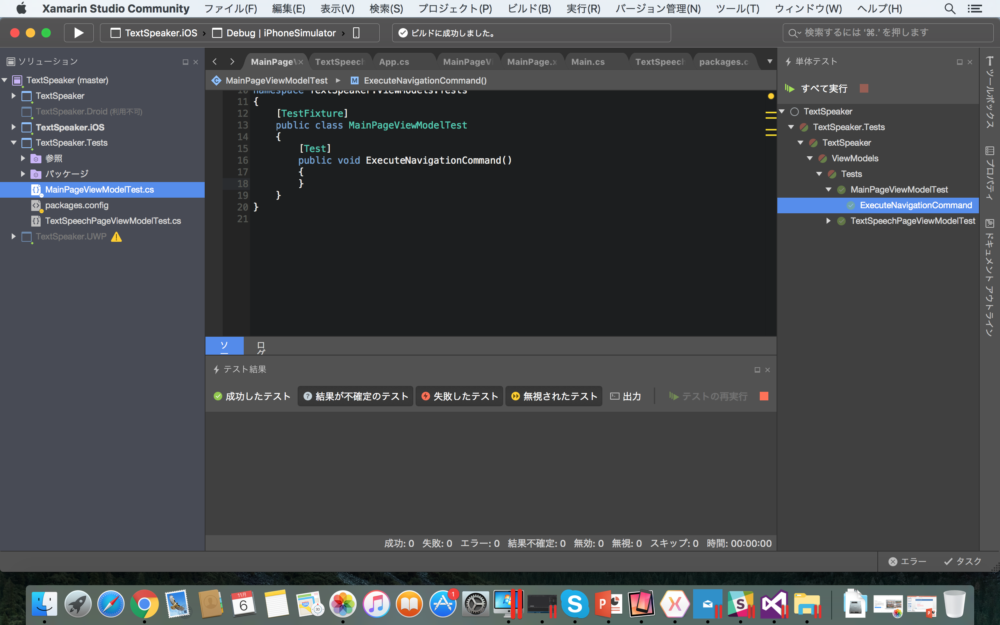
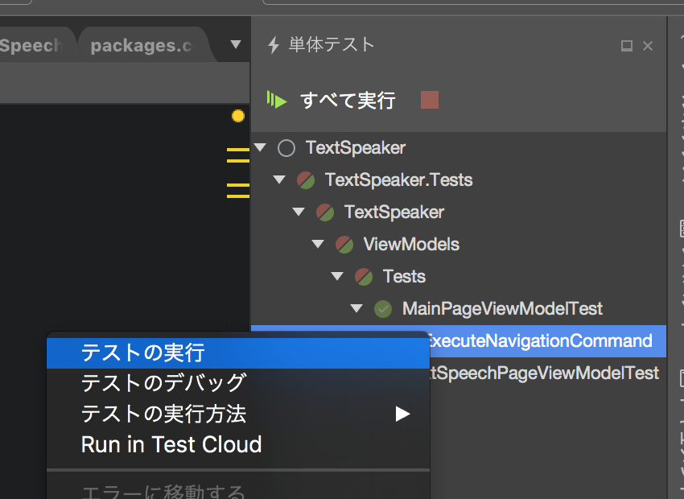

# 画面遷移ロジックをViewModelに移動する

さて、一つ目の課題についてリファクタリングしていきます。  
それは画面遷移のロジックがコードビハインドに存在するという事です。  

勘違いしていただきたくないのですが、コードビハインドにコードが存在すること自体が悪なわけではありません。  
しかし、コードビハインドにコードがある事は、好ましい状況ではないケースが多いことは確かです。  
コードビハインドに記述することが好ましくない理由は以下の2点にあります。  

* テスタビリティが悪化する  
* コードの再利用性が低下する  
* ロジックが分散し、全体の見通しが悪化する  

今回の場合、MainPageからTextSpeechPageへの画面遷移ロジックがコードビハインドに記述されています。    
これはユニットテストを困難にしています。  
なぜならViewの自動テストは複数の要因から非常に困難だからです。  

と言う分けで、画面遷移のロジックをViewからViewModelに移動していきます。  

TDDで実装する場合、大まかな手順は以下の通りです。  

1. テストコードが実装できるよう、テスト対象のガワ（インターフェースなど）を実装する  
2. テストコードを実装する    
3. テストがエラーとなり、正しくテストが実装されている（ように思える）ことを確認する  
4. プロダクションコードを実装する  
5. テストを実行し正しく実装されていることを確認する

これを繰り返していきます。

## テストコードが実装できるよう、テスト対象のガワ（インターフェースなど）を実装する

まずは、MainPageViewModel.csを開き、NavigationCommandを宣言してください。  

```cs  
    public class MainPageViewModel
    {
        public ICommand NavigationCommand => null;
```

テストファーストで進めるため、実装はせずあえて宣言するのみです。  
続いてMainPage.xaml.csのイベントハンドラをコメントアウトします。  

```cs
    public partial class MainPage : ContentPage
    {
        public MainPage()
        {
            InitializeComponent();
        }

        //private async void Button_OnClicked(object sender, EventArgs e)
        //{
        //    var result = await DisplayAlert("確認", "Text Speech画面へ遷移しますか？", "OK", "Cancel");
        //    if (result)
        //    {
        //        await Navigation.PushAsync(new TextSpeechPage());
        //    }
        //}
    }
```  

続いてMainPage.xamlを開き以下の修正を行います。  
これはちょっとプロダクションコードの修正になってしまっていますが次の理由で許容します。  

* イベントハンドラをコメントアウトしたため、コンパイルが通らない  
* Viewはユニットテストの対象外  

さて修正の概要は以下の通りです。  

* ボタンクリックイベントハンドラをCommandのバインドに変更  
* BindingContextへViewModelを設定しているコードを削除  
* ViewModelLocator.AutowireViewModel="True"を宣言する  

```xml
<?xml version="1.0" encoding="utf-8" ?>
<ContentPage xmlns="http://xamarin.com/schemas/2014/forms"
             xmlns:x="http://schemas.microsoft.com/winfx/2009/xaml"
             xmlns:viewModels="clr-namespace:TextSpeaker.ViewModels;assembly=TextSpeaker"
             xmlns:mvvm="clr-namespace:Prism.Mvvm;assembly=Prism.Forms"
             mvvm:ViewModelLocator.AutowireViewModel="True"
             x:Class="TextSpeaker.Views.MainPage"
             Title="MainPage">
  <StackLayout HorizontalOptions="Center" VerticalOptions="Center">
    <Button Text="Go to Text Speech" Command="{Binding NavigationCommand}"/>
  </StackLayout>
</ContentPage>
```

## テストコードを実装する

これでテストを書く準備が整いました。  
それではMainPageViewModelTest.csを開いて、NavigationCommandに対するテストコードを記述していきます。  

```cs
        [Test]
        public void ExecuteNavigationCommand()
        {
            var viewModel = new MainPageViewModel();
            var command = viewModel.NavigationCommand;
            Assert.IsNotNull(command);
            Assert.IsTrue(command.CanExecute(null));
        }
```

ひと先ずは上述のレベルまで記載します。  

* NavigationCommandがnullではないこと  
* NavigationCommandが常に実行可能であること  

をテストしています。  
それではテストを実行しましょう。  

### テストを実施する：Visual Studio編  

Visual Studioでテストを実行する場合、まずはテストエクスプローラを開くのが良いでしょう。  
「テスト」メニューから「ウィンドウ」を選択し、「テストエクスプローラ」を開きましょう。  



以下のような画面が開かれるはずです。



ここで、今回作成したExecuteNavigationCommandを右クリックし「選択したテストの実行」をクリックしましょう。  



テストがエラーとなれば成功です。  

### テストを実施する：Xamarin Studio編  

Visual Studioでテストを実行する場合、表示を「テスト」に切り替えます。    
「表示」メニューから「テスト」を開きましょう。    



以下のような画面が開かれるはずです。



ここで、今回作成したExecuteNavigationCommandを右クリックし「テストの実行」をクリックしましょう。  



テストがエラーとなれば成功です。  


## プロダクションコードを実装する  

というわけで、このテストが通るところまで実装します。  
MainPageViewModel.csを開いてください。  
NavigationCommandにCommandを割り当て、空のNavigateメソッドを追加しましょう。  

```cs
        public ICommand NavigationCommand => new Command(Navigate);
        private void Navigate()
        {
            throw new NotImplementedException();
        }
```  

## テストを実行し正しく実装されていることを確認する

それではテストを実行します。  
成功になりましたね？  

あとはこれを繰り返して実装を徐々に大きくしていきます。  

## 画面遷移するまでのテストとプロダクションコードを実装する

それではいよいよ画面遷移のテストを書くのですが、その前にテストコードを書く準備をします。  
Prismでは画面遷移はNavigationServiceを利用するとお話ししました。  
そしてそのNavigationServiceのインスタンスはDIコンテナからインジェクションして渡してもらいます。  

ではMainPageViewModel.csを開いて以下の修正を行ってください。  

* コンストラクタの引数にINavigationServiceを追加する  
* コンストラクタで受け取った引数をフィールドに保存する  

```cs
        private readonly INavigationService _navigationService;
        public MainPageViewModel(INavigationService navigationService)
        {
            _navigationService = navigationService;
        }
```

これでテストケースを書く準備ができました。  
それではMainPageViewModelTest.csを開いてください。  
コンストラクタに引数を追加したため、テストメソッドがコンパイルエラーになっています。  
ここでMoqを利用してINavigationServiceのMockを設定し、画面遷移のテストコードを追記します。  

```cs
        public void ExecuteNavigationCommand()
        {
            var navigationService = new Mock<INavigationService>();
            var viewModel = new MainPageViewModel(navigationService.Object);
            var command = viewModel.NavigationCommand;
            Assert.IsNotNull(command);
            Assert.IsTrue(command.CanExecute(null));

            command.Execute(null);

            navigationService.Verify(m => m.NavigateAsync("TextSpeechPage", null, null, true), Times.Once);
        }
```

ポイントは2点あります。  
Mock&lt;T&gt;を作成すると、そのObjectプロパティとして自動的にTのMockが作成されるということです。  
中身は見ていませんが、おそらくProxyを利用しているのではないでしょうか？  

そしてnavigationService.Verifyです。  
この中で式木を利用して、Mockのメソッドが呼び出されたかどうか、確認しています。  

ではテストを実行してエラーとなることを確認してください。

エラーとなることを確認したら、やっと画面遷移のロジックを実装します。  
MainPageViewModel.csを開いてNavigationメソッドを以下のように実装します。  

```cs
        private void Navigate()
        {
            _navigationService.NavigateAsync("TextSpeechPage");
        }
```  

Verifyで指定した引数と異なりますが、第二引数移行は省略可能なためこちらでは省略しています。    
しかし式木で指定する場合は省略できないため、このような差異がでています。  

それではテストを実行して成功を確認したら、デバックでアプリケーションを起動してみましょう。  
確認ダイアログの実装がまだのため、ボタンを押したらそのまま次の画面へ遷移するはずです。  

では引き続き、[確認ダイアログの実装へ移りましょう](04.HandsOn-IConfirmNavigationAsync.md)
