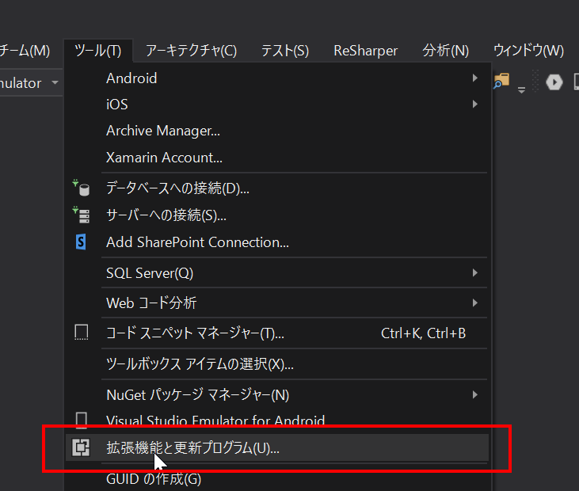
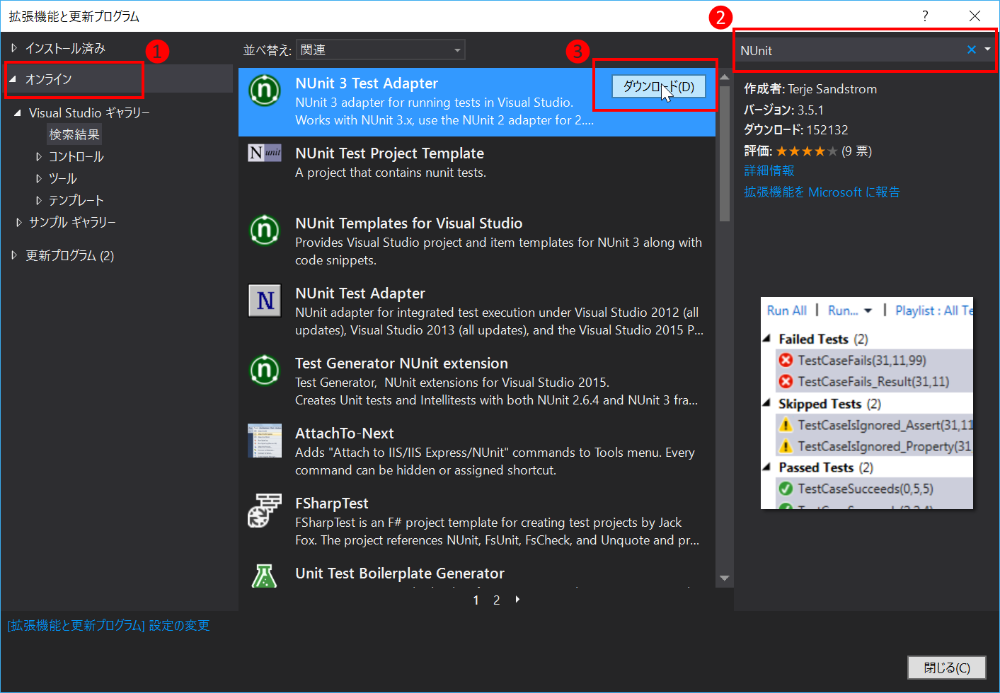
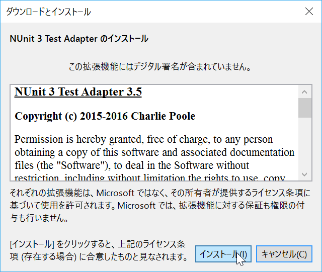
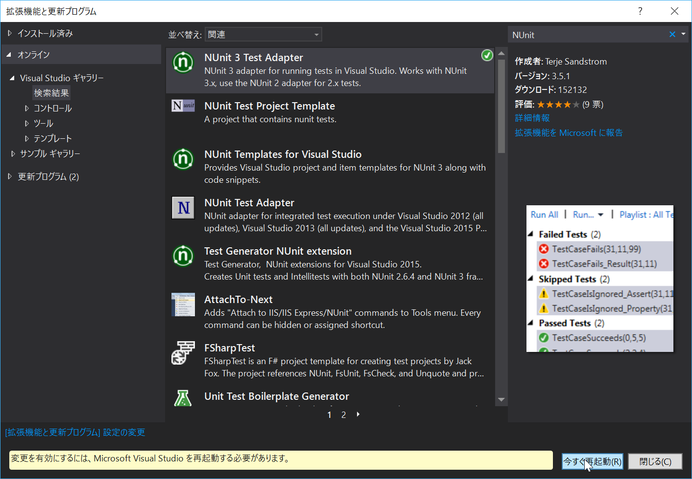

# Visual Studioの環境をセットアップする

本ハンズオンを実施するためには、Visual StudioでNUnitが実行できるように拡張機能をあてる必要があります。  
2016年11月現在、Visual StudioとXamarin StudioのUnitテスト対応状況は以下の通りです。  

||Visual Studio|Xamarin Studio|
|:--|:-:|:-:|
|MSTest|○|×|
|NUnit|△|○|
|xUnit|△|△|

ここの○×△の意味合いは以下の通りです。  

|項目|説明|
|:-:|:--|
|○|デフォルトの状態で実行可能|
|△|拡張機能をインストールすることで実行可能|
|×|実行不可能|

この為、本ハンズオンではVisual Studioユーザにはやや手間をかけさせてしまいますが、NUnitを採用することにしました。  

本節ではNUnitをVisual Studioで利用可能とするアドインの手順を記載します。  

まずVisual Studioを開き、「ツール」メニューから「拡張機能と更新プログラム」を開きます。

続いて以下の手順で拡張機能をインストールします。  

1. 左のメニューのオンラインを選択  
2. 検索ボックスで「NUnit」を入力  
3. 検索結果の中から「NUnit 3 Test Adapter」をダウンロードする  

画面の指示に従ってダウンロードインストールしましょう。  

インストールが完了すると、Visual Studioの再起動が求められます。  

あとは再起動したら準備作業は完了です。  
